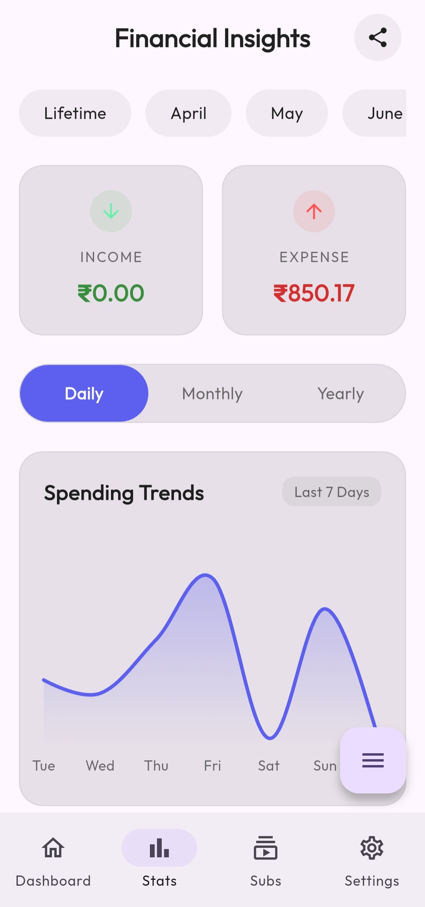
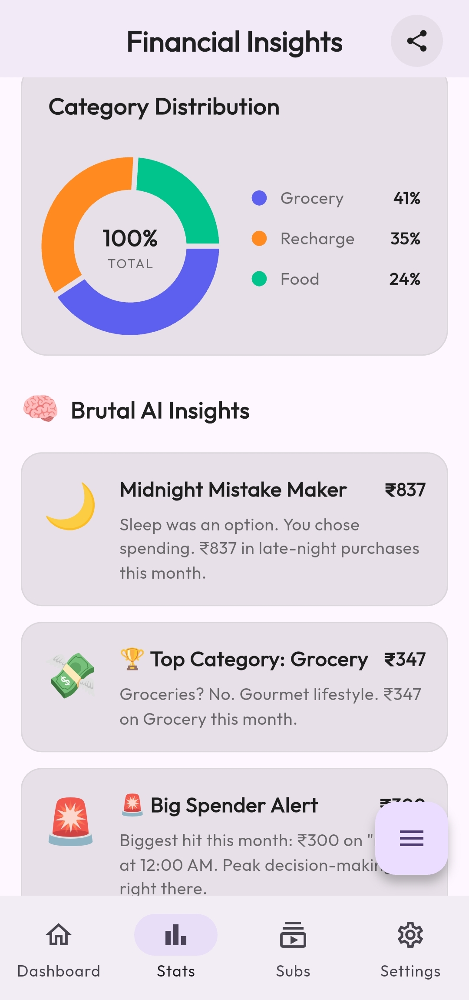
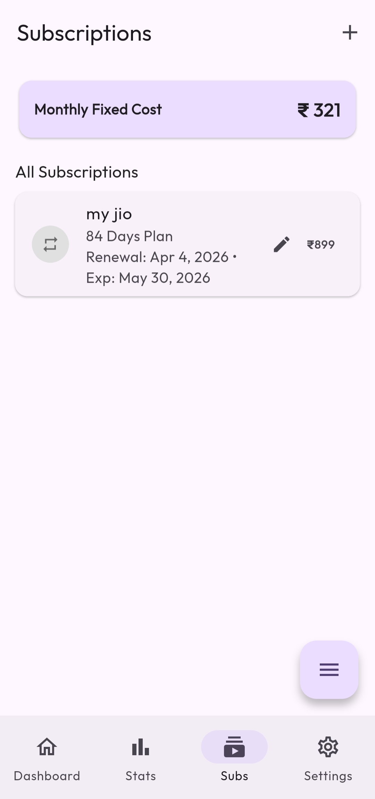
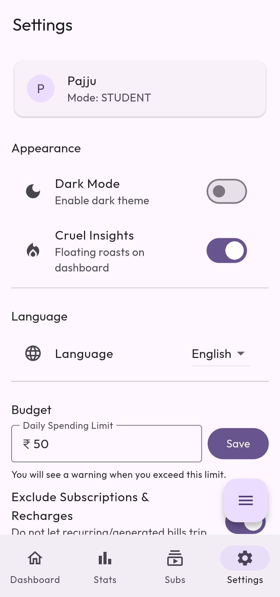

# NammaExpense
> **Smart, Context-Aware Expense Tracking for Digital India**

NammaExpense is a professional personal finance management application built with Flutter. It differentiates itself from standard trackers through **behavioral economics** (AI-driven roasts), **contextual intelligence** (time-aware category suggestions), and **seamless data entry** (SMS parsing and Voice-to-Text).

---

## 📸 Interface Preview

| Dashboard & Insights | Analytics & Trends |
| :---: | :---: |
|  |  |
| *Context-aware roasts and balance overview* | *Dynamic spending trends visualization* |

| Category Distribution | Subscriptions & Recharges |
| :---: | :---: |
|  |  |
| *Granular category-level roasts* | *Multi-month validity tracking* |

| Settings & Customization |
| :---: |
|  |
| *Localized support and theme control* |

---

## 🚀 Key Technical Features

### 🧠 Behavioral Finance: Brutal AI Insights
Rather than static charts, NammaExpense uses actual transaction data (last 30 days) to generate **personalized roasts**.
*   **Time-Based Patterns**: Detects late-night spending or morning consumerism.
*   **Tiered Tones**: Rotates between Playful, Sharp, and "Savage" tones based on the severity of budget deviation.
*   **Floating Toast System**: Animated speech-bubble insights on the dashboard that auto-rotate every 5 seconds.

### ⚡ Seamless Data Entry
*   **Clipboard SMS Parsing**: Instantly extracts transaction amounts from bank/UPI SMS strings in the clipboard.
*   **Voice-to-Text (STT)**: Integrated speech recognition for hands-free expense entry (e.g., *"Spent 500 on dinner"*).
*   **Contextual Suggestions**: A "Quick Add" FAB that prioritizes categories based on the current time of day and weekend state.

### 🛠️ Robust Infrastructure
*   **Offline-First**: 100% functional without internet using `SQLite` for relational data and `SharedPreferences` for configuration metadata.
*   **Complex Subscription Logic**: Native handling of Indian telecom recharge cycles (28/56/84 days) with exact expiration alerts.
*   **Native Android Widgets**: Home-screen integration allowing users to track balance and add expenses without opening the app.
*   **Localization**: First-class support for **Kannada** and English, featuring conversational regional dialects rather than robotic translations.

---

## 💻 Tech Stack

*   **Framework**: Flutter (Dart 3.x)
*   **State Management**: `Provider` (Clean, scalable architecture)
*   **Database**: `sqflite` (SQLite for Flutter)
*   **Data Visualization**: `fl_chart`, `flutter_heatmap_calendar`
*   **Native Integration**: Kotlin (Android Native Widgets, SMS listeners)
*   **AI/Inference**: Custom logic based on spending streaks and category outliers.

---

## 📦 Getting Started

### Prerequisites
- Flutter SDK (Latest Stable)
- Android Studio / VS Code
- A physical Android device (Recommended for Native Widgets and STT)

### Installation
1.  **Clone the Repository**
    ```bash
    git clone https://github.com/pajjuh/namma-expense.git
    cd namma-expense
    ```

2.  **Install Dependencies**
    ```bash
    flutter pub get
    ```

3.  **Run the Application**
    ```bash
    flutter run
    ```

---

*Built with a focus on User Experience and Behavioral Finance.*
